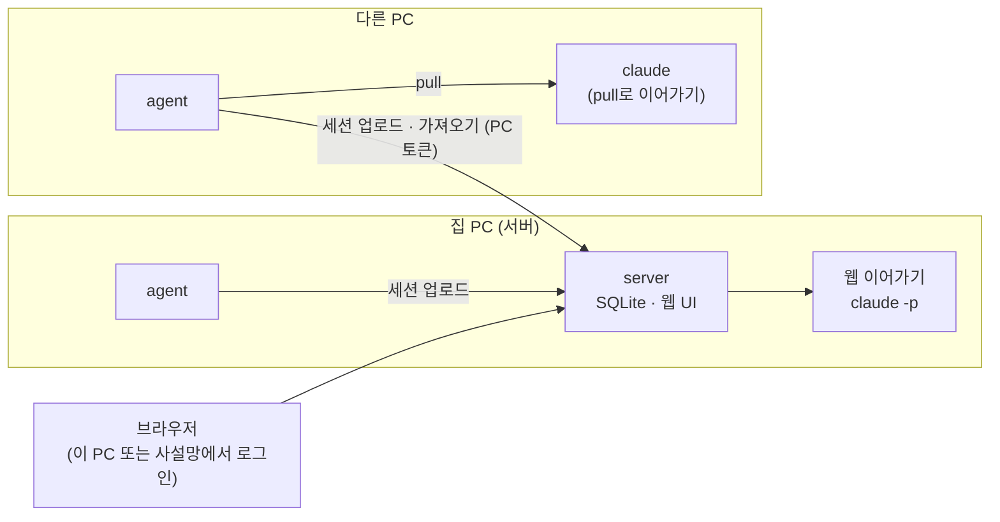

# llm-session-db

여러 PC에서 사용한 **Claude Code 세션을 한 서버에 모아** 웹에서 검색·열람하고, **웹에서 바로 또는 다른 PC에서 이어서 대화**할 수 있게 해 주는 개인용 세션 서버입니다.

Claude Code는 세션을 실행한 폴더 기준으로 각 PC의 `~/.claude/projects`에만 저장합니다. llm-session-db는 이 기록을 서버에 보관해 PC·폴더에 묶이지 않고 어디서든 찾아보고 이어갈 수 있게 합니다.

## 주요 기능

- **자동 수집** — 각 PC의 에이전트가 세션 파일에서 새로 추가된 줄만 서버로 보냅니다. 서버가 꺼져 있어도 원본 파일이 남아 있으므로 다시 연결되면 이어서 보냅니다.
- **세션 열람** — PC·프로젝트별 목록, 도구 호출·결과를 접어 보여 주는 대화 뷰, 서브에이전트 대화, 원본·분기 세션 링크
- **전문 검색** — 한국어도 부분 문자열로 검색(SQLite FTS5 trigram), 결과를 누르면 해당 메시지로 이동
- **토큰 통계** — 일별 토큰 차트, 모델·PC·프로젝트별 입력·출력·캐시 토큰과 비용
- **웹에서 이어가기** — 서버 PC에서 Claude Code를 실행해 응답을 실시간으로 보여 줍니다. 허용할 도구(파일 수정·명령 실행·웹)를 고르고, 거부된 도구는 허용 후 계속 진행할 수 있습니다.
- **다른 PC로 가져와 이어가기** — `agent pull`로 서버의 세션을 가져와 그 PC에서 `claude`로 이어갑니다. 이어간 기록은 새 세션으로 수집되고 원본과 자동으로 연결됩니다.
- **원격 접속·보안** — 웹 UI 비밀번호 로그인, PC별 에이전트 토큰, Windows 로그인 시 자동 실행
- **GUI 관리 창** — 명령 없이 실행하면 창이 열립니다. 에이전트 설정·상태·자동 실행·가져오기를 탭에서 다루고, 서버 PC에서는 서버 시작·중지, PC 등록(토큰 발급), 비밀번호 설정 탭이 더 붙습니다. 모든 기능은 CLI 명령으로도 됩니다.

## 구성



| 구성요소 | 설명 |
|---|---|
| `server/` | FastAPI 서버. 원본 줄을 그대로 보관하고 세션·메시지·사용량을 파생 테이블로 정리, 웹 UI 제공 |
| `agent/` | 표준 라이브러리만 쓰는 수집 에이전트와 tkinter GUI 창. 원격 PC에는 Python 또는 릴리즈의 exe만 있으면 됩니다 |

배포는 [Releases](https://github.com/huny4daniel/llm-session-db_v/releases)의 exe 두 가지로 합니다. 저장소를 내려받아 실행하는 것은 개발용입니다.

| 파일 | 용도 |
|---|---|
| `LlmSessionServer_vX.Y.Z.exe` | 서버 PC용. 서버 + 이 PC의 에이전트 + 관리 창이 모두 들어 있어 이 파일 하나만 두면 됩니다 |
| `LlmSessionAgent_vX.Y.Z.exe` | 다른 PC용. 에이전트 + 관리 창(설정·상태·가져오기) |

## 요구 사항

- Windows 10/11 (자동 실행 등록은 Windows 전용, 나머지는 Python이 되는 환경이면 동작)
- 릴리즈 exe를 쓰면 Python이 필요 없습니다. 저장소에서 직접 실행(개발)할 때만 Python 3.13
- Claude Code CLI — 수집 대상이며, 웹 이어가기·가져오기에 사용

## 설치

### 1. 서버 (집 PC)

`LlmSessionServer_vX.Y.Z.exe`를 옮기지 않을 폴더(예: `E:\llm-session-db`)에 두고 더블클릭하면 관리 창이 열립니다.

1. **서버** 탭: "자동 실행 등록"을 누르면 서버가 로그인 시 시작되고 지금 바로 뜹니다. 이 PC의 에이전트도 `Local`이라는 이름으로 자동 등록되어 함께 시작되므로 서버 PC에서는 토큰을 옮길 필요가 없습니다.
2. 다른 PC를 붙이려면 같은 탭에서 PC 이름을 넣고 등록해 토큰을 발급합니다. 원격 접속이면 비밀번호도 설정합니다.

DB·로그·작업 폴더는 exe 옆의 `data\`에 생깁니다(환경 변수 `LSDB_DATA_DIR`로 변경). 명령으로 하려면 서버 명령은 그대로, 에이전트 명령은 `agent` 뒤에 씁니다.

```powershell
.\LlmSessionServer_vX.Y.Z.exe install                 # 서버 자동 실행 등록 + 지금 시작 + 이 PC 에이전트(Local) 등록·시작
.\LlmSessionServer_vX.Y.Z.exe add-machine laptop      # 다른 PC 등록. 토큰이 한 번만 표시되니 보관
```

`Local`은 서버 PC 자신을 뜻하는 고정 이름이라 바꾸거나 지울 수 없습니다.

새 버전으로 바꿀 때는 서버 탭(또는 `stop`, `agent stop`)으로 둘 다 멈추고 새 exe를 같은 폴더에 둔 뒤 다시 자동 실행 등록합니다(등록 명령에 exe 경로가 들어가므로).

### 2. 에이전트 (서버 PC 포함, 세션을 모을 모든 PC)

`LlmSessionAgent_vX.Y.Z.exe`를 옮기지 않을 위치에 두고 더블클릭하면 관리 창이 열립니다.

1. **설정** 탭: 서버 주소와 토큰을 넣고 저장 → 연결 확인
2. **상태** 탭: 자동 실행 등록(로그인 시 창 없이 실행 + 지금 시작), 미전송 파일 확인, 로그 열기

같은 작업을 명령으로 하려면:

```powershell
.\LlmSessionAgent_vX.Y.Z.exe setup --server http://<서버 주소>:8765 --token <토큰>
.\LlmSessionAgent_vX.Y.Z.exe status     # 서버 연결·미전송 파일 확인
.\LlmSessionAgent_vX.Y.Z.exe install    # 로그인 시 창 없이 자동 실행 + 지금 시작
```

설정·로그는 `~/.llm-session-db/`에 저장됩니다.

### 3. 원격 접속 (선택)

> 아래 절차는 설계상 동작하도록 만들었지만, 아직 Tailscale 환경에서 실제로 검증하지 않았습니다.

1. 서버 PC와 각 PC에 [Tailscale](https://tailscale.com/)을 설치하고 같은 계정으로 로그인합니다.
2. 서버 PC에서 웹 UI 비밀번호를 설정합니다(관리 창 서버 탭 또는 아래 명령). 비밀번호를 설정하면 이 PC에서 접속할 때도 로그인이 필요합니다.
   ```powershell
   .venv\Scripts\python -m server set-password
   ```
3. 서버를 사설망에 공개합니다.
   - 권장: 서버는 기본 주소(127.0.0.1) 그대로 두고 `tailscale serve --bg 8765`로 tailnet에만 HTTPS로 노출
   - 또는: 관리 창 서버 탭에서 주소를 서버의 Tailscale IP로 바꿔 자동 실행 등록(`python -m server install --host <IP>`와 같음)
4. 원격 PC마다 서버 탭의 PC 등록(또는 `add-machine`)으로 토큰을 발급해 에이전트를 설정합니다.

비밀번호 없이 루프백이 아닌 주소로 서버를 열려고 하면 거부됩니다. 서버를 공인 인터넷에 직접 노출하지 마세요.

## 사용법

### 세션 보기·검색·통계

브라우저에서 서버 주소(기본 http://127.0.0.1:8765)를 엽니다.

- **세션** — 왼쪽에서 PC·프로젝트로 거르고, 제목·첫 질문·경로로 필터
- **검색** — 공백으로 나눈 모든 단어를 포함한 메시지를 최신순으로 표시
- **통계** — 기간(7·30·90일)과 지표(전체·입력·출력·캐시)별 일별 토큰

### 웹에서 이어가기

세션 화면 맨 아래 **이어서 대화하기**에 메시지를 입력합니다(Ctrl+Enter).

| 상황 | 동작 |
|---|---|
| 서버 PC에 세션 파일이 있음 | 같은 세션에 이어서 기록 |
| 없음 (다른 PC 세션) | 수집된 기록으로 새 세션을 만들어 이어감 (원본은 그대로) |
| 원래 프로젝트 폴더가 서버 PC에 있음 | 그 폴더에서 실행. 읽기 도구는 기본 허용, 고른 도구만 추가 허용 |
| 폴더가 없음 | 도구 없이 대화만 |

- 응답은 실시간으로 표시되며 중단할 수 있습니다. 중단하면 스트리밍 중이던 응답은 세션에 저장되지 않습니다.
- 실행 결과는 에이전트가 수집한 뒤 기록에 반영됩니다.
- 서버 PC에서 명령을 실행하는 기능이므로 원격에서 쓸 때는 반드시 비밀번호를 설정하세요.

### 다른 PC로 가져와 이어가기

이어갈 PC에서 관리 창의 **가져와 이어가기** 탭을 엽니다. 서버의 세션 목록을 불러와 고르고, 작업 폴더를 정한 뒤 **claude 실행**을 누르면 새 터미널 창에서 이어집니다. **명령 복사**는 실행 대신 명령만 클립보드에 담습니다.

명령으로 하려면 웹 세션 화면의 **다른 PC로 가져와 이어가기** 명령을 복사해 실행합니다.

```powershell
python -m agent pull <세션 ID 앞부분> --run
```

- `--run`을 빼면 실행할 명령만 보여 줍니다.
- `--dir <폴더>`로 작업 폴더를 정할 수 있습니다. 지정하지 않으면 원래 프로젝트 폴더가 그 PC에 있을 때 그곳, 없으면 현재 폴더에서 이어갑니다.
- 대화 기억만 옮겨지고 코드 파일은 옮겨지지 않습니다. 같은 저장소가 있는 폴더에서 이어가는 것을 권장합니다.

## 명령어

명령 없이 실행하면 관리 창(GUI)이 열립니다. 아래 명령은 같은 기능의 CLI입니다. exe에서는 `python -m server`를 `LlmSessionServer_vX.Y.Z.exe`로, `python -m agent`를 `LlmSessionAgent_vX.Y.Z.exe`(서버 exe에서는 `LlmSessionServer_vX.Y.Z.exe agent`)로 바꿔 읽으세요.

### 서버 — `python -m server <명령>`

| 명령 | 설명 |
|---|---|
| `gui` | 관리 창 열기(기본) |
| `serve [--host] [--port] [--log-file]` | 서버 실행 |
| `install [--host] [--port] [--no-start] [--no-agent]` / `uninstall` | Windows 로그인 시 자동 실행 등록·해제. `install`은 이 PC의 에이전트도 `Local`로 등록해 시작 |
| `stop [--host] [--port]` | 백그라운드 서버 종료 |
| `set-password [--stdin]` / `clear-password` | 웹 UI 비밀번호 설정·제거 |
| `add-machine <이름>` / `rotate-token <이름>` / `machines` | 에이전트 PC 등록·토큰 재발급·목록 |
| `rename-machine <이름> <새 이름>` / `delete-machine <이름> [--yes]` | PC 이름 변경(세션 유지) · PC와 그 세션 전부 삭제 |
| `delete-session <번호\|세션 ID>...` | 세션 삭제 (PC의 원본 파일은 남고 다시 수집되지 않음) |
| `rebuild` | 원본 줄로 파생 데이터 전체 재생성 |

### 에이전트 — `python -m agent <명령>`

| 명령 | 설명 |
|---|---|
| `gui` | 관리 창 열기(기본) |
| `setup --server <URL> --token <토큰> [--claude-root]` | 설정 저장 |
| `run [--once] [--interval 초] [--log-file]` | 수집 실행 (기본 30초 간격 반복) |
| `status` | 설정·자동 실행·실행 여부·서버 연결·미전송 파일 |
| `install [--interval] [--no-start]` / `uninstall` | 로그인 시 자동 실행 등록·해제 |
| `stop` | 백그라운드 에이전트 종료 |
| `pull <번호\|세션 ID> [--dir] [--run]` | 서버 세션을 이 PC로 가져와 이어가기 |

### 환경 변수

| 변수 | 기본값 | 설명 |
|---|---|---|
| `LSDB_DATA_DIR` | exe 옆 `data\` (저장소 실행은 프로젝트 `data/`) | 서버 DB·로그·작업 폴더 위치 |
| `LSDB_AGENT_CONFIG` | `~/.llm-session-db/agent.json` | 에이전트 설정 파일 (같은 폴더에 로그·잠금 파일) |
| `LSDB_CLAUDE_ROOT` | `~/.claude/projects` | 서버가 웹 이어가기에 쓰는 Claude Code 세션 폴더 |
| `LSDB_CLAUDE_BIN` | PATH의 `claude` | claude 실행 파일 경로 |

## 보안

- 세션에는 API 키·토큰·`.env` 내용·소스 코드가 포함될 수 있습니다. 서버는 이 PC 또는 사설망에서만 여세요.
- 에이전트 토큰은 DB에 해시로만 저장됩니다.
- 웹 UI: 비밀번호가 없으면 이 PC에서 온 요청만 허용하고(프록시를 거친 요청은 원격으로 판단), 비밀번호가 있으면 모든 요청에 로그인이 필요합니다. 로그인은 HttpOnly·SameSite=Strict 쿠키로 30일 유지되며, 비밀번호를 바꾸면 모두 로그아웃됩니다.

## 알려진 제한

- **Claude Code 세션 파일 형식은 공식 문서화되어 있지 않습니다.** CLI 업데이트로 형식이 바뀌면 파서 수정 후 `python -m server rebuild`로 다시 만들 수 있도록 원본 줄을 모두 보관합니다. 이어가기 관련 동작은 Claude Code 2.1.272 기준으로 확인했습니다.
- 웹 이어가기의 실행 상태는 서버 메모리에만 있어 서버를 재시작하면 사라집니다(대화 내용은 세션 파일에 남음).
- 분기로 만든 세션은 CLI가 원본 제목을 그대로 복사해 제목이 같게 보입니다.
- 세션을 삭제하면 그 번호가 새 세션에 다시 쓰일 수 있습니다. 명령에는 가능하면 세션 ID를 쓰세요.
- 체크포인트(파일 되돌리기 기록)는 다른 PC로 옮기지 않습니다.
- Codex CLI 세션은 아직 수집하지 않습니다.

## 개발

```powershell
git clone https://github.com/huny4daniel/llm-session-db_v.git
cd llm-session-db_v
python -m venv .venv
.venv\Scripts\python -m pip install -r requirements-dev.txt
.venv\Scripts\python -m pytest
.venv\Scripts\python -m server serve --port 8790   # 개발용 서버(실제 설치와 포트·데이터 폴더를 분리)
```

- 테스트는 실제 Claude Code를 실행하지 않고 `tests/fake_claude.py`로 CLI 출력을 흉내 냅니다. GUI 테스트는 창을 띄우지 않고 위젯만 만들어 확인합니다.
- `v*` 태그를 푸시하면 GitHub Actions가 서버 exe와 에이전트 exe를 빌드해 릴리즈에 첨부합니다(같은 major.minor의 이전 릴리즈는 삭제).
- 설계 배경, 검증된 CLI 동작, 코드 구조는 [CLAUDE.md](CLAUDE.md)에 정리되어 있습니다.

## 로드맵

- [x] 서버 코어: 수집·열람·검색·통계
- [x] 원격 접속: 로그인·자동 실행·에이전트 exe
- [x] 웹에서 이어가기
- [x] 다른 PC로 가져와 이어가기
- [x] GUI 관리 창 (에이전트·서버)
- [ ] Codex CLI 세션 지원
- [ ] Tailscale 원격 접속 실사용 검증
